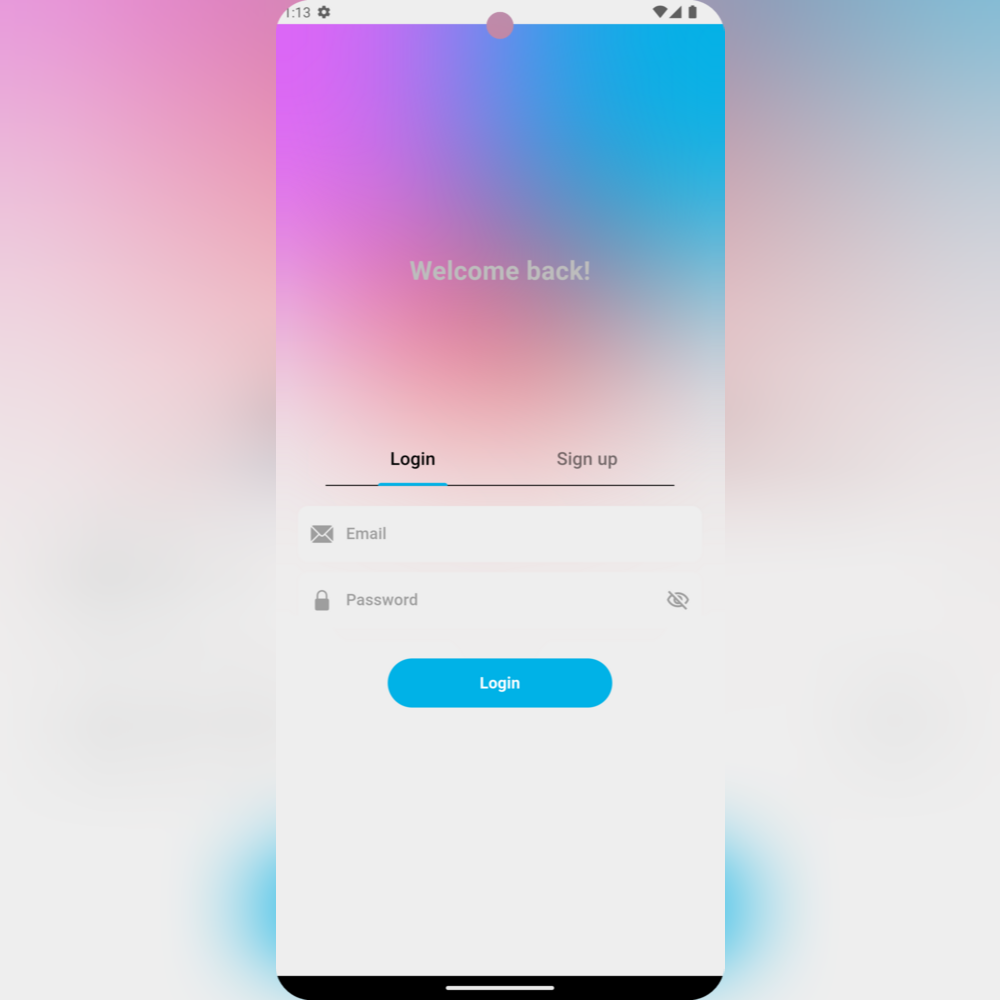
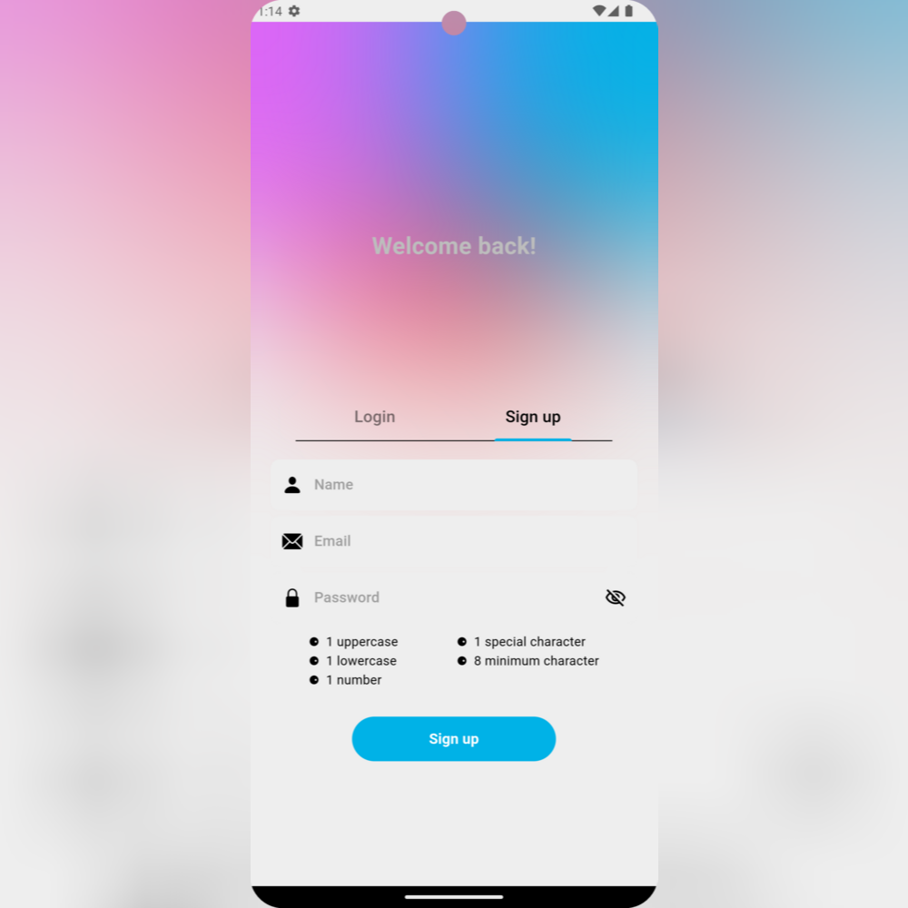
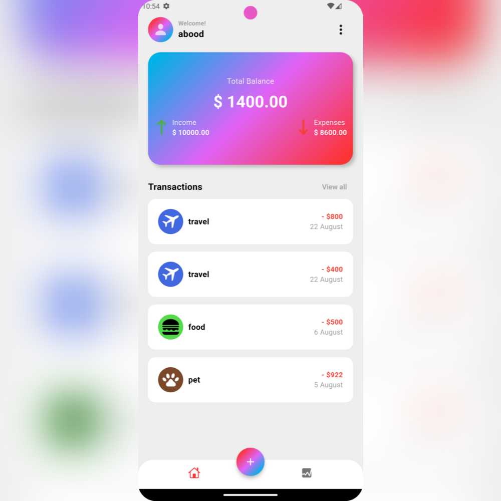
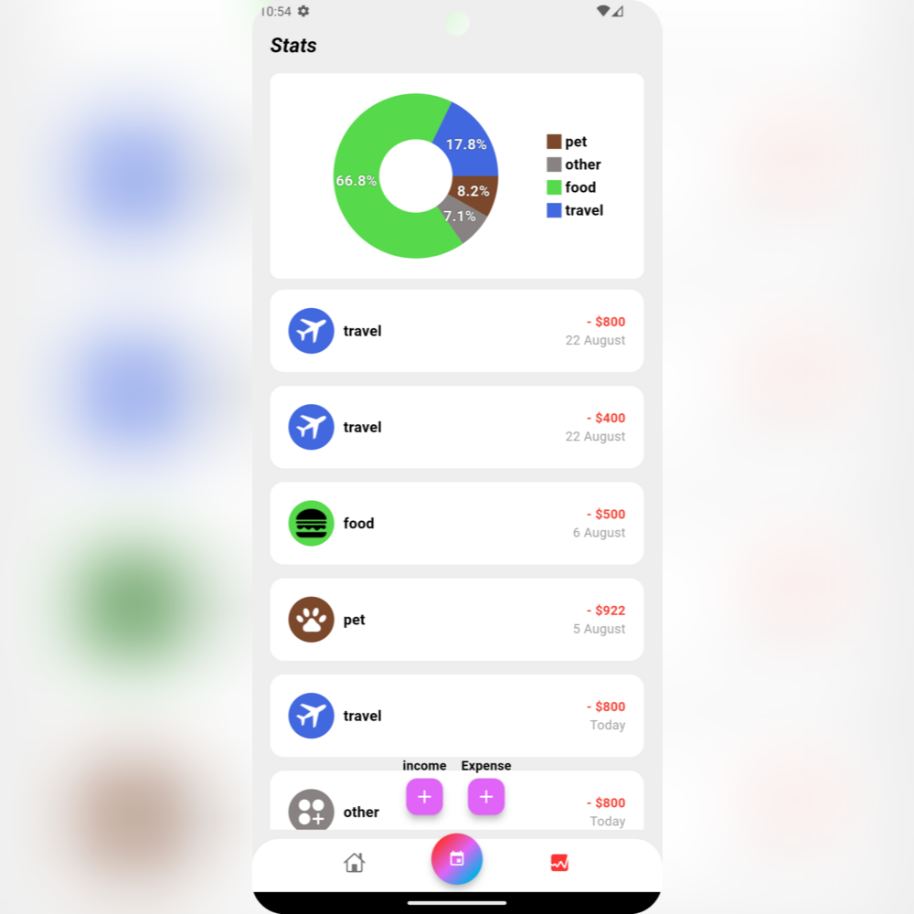
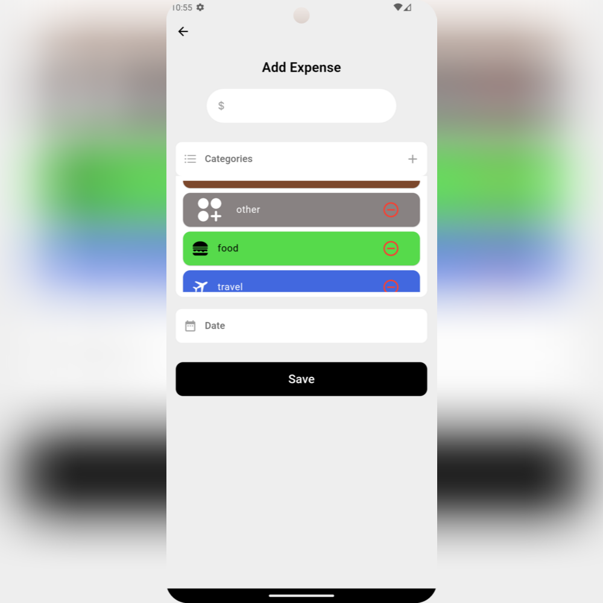
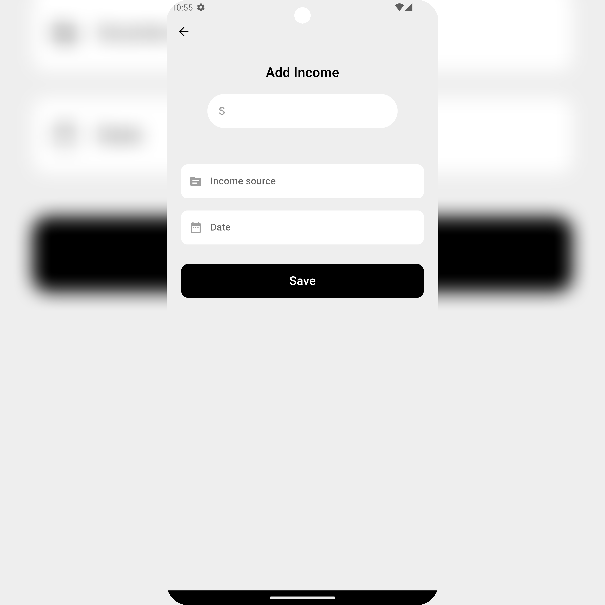

# WalletWhiz

Wallet tracker created for tracking your expenses using flutter.

## Result

### UI
|  |  |  |  | | 

|----------|:----------:|:--------:|:---------:|:---------:|

## Technologies Used

This wallet tracker app leverages a range of modern technologies to deliver a robust and efficient application. Below are the key technologies and libraries utilized:

- **[Flutter](https://flutter.dev/)**: The primary framework used for development, offering a rich set of widgets and tools for building natively compiled applications for mobile, web, and desktop from a single codebase.
- **[Firebase](https://firebase.google.com/)**: A comprehensive app development platform that provides cloud-based services such as Firestore for database management, Firebase Authentication for user management, and Firebase Storage for file storage.
- **[Bloc](https://bloclibrary.dev/)**: A predictable state management library that helps to manage the state of the application using the BLoC (Business Logic Component) pattern.
- **[Get It](https://pub.dev/packages/get_it)**: A simple and efficient service locator for dependency injection in Flutter applications.
- **[Cupertino Icons](https://pub.dev/packages/cupertino_icons)**: Provides a comprehensive set of Cupertino-styled icons for Flutter applications.
- **[FlChart](https://pub.dev/packages/fl_chart)**: A powerful charting library for Flutter that provides a wide range of customizable charts, including PieChart.

## Features

- **User Authentication**: Securely handles user sign-in and sign-out using Firebase Authentication.
- **Category Management**: Allows users to create, edit, and delete expense categories.
- **Expense Tracking**: Users can add, edit, and delete expenses, and view them categorized by type.
- **Pie Chart Visualization**: Visualizes expenses by category using a pie chart for better financial insights.
- **Expense Summary**: Provides a summary of total expenses and expenses per category.
- **Responsive UI**: Ensures a seamless user experience across different devices with a responsive design.
- **Error Handling**: Implements robust error handling to manage and display errors gracefully.
- **Delete All Records**: Allows users to delete all expense records at once with a confirmation dialog to prevent accidental deletions.

## Installation

To use the WalletWhiz app,
you can download it from the following link: 
[WalletWhiz apk](https://www.mediafire.com/file/7gqvp1j3sir66tg/wallet-whiz.apk/file)

## Upcoming implementations

- **Local Stroage**: Ability to access your wallet while being offline.

